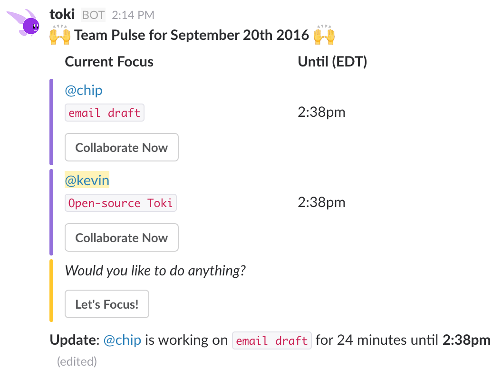
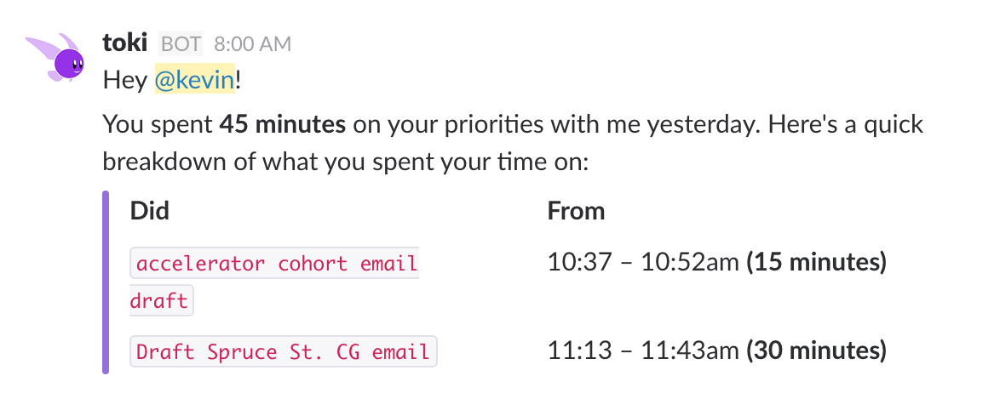

# Toki: attention management for teams

**Toki is an attention management slackbot for teams.** Its purpose is to enable focused work for individuals, while maintaing the amazing benefits of Slack (collaboration, transparency and fun).

We have personally noticed a growing problem: our daily attention cannot grow at the exponential rate of technology. The resulting information overload, multi-tasking and context switching drains the 4 to 6 hours of daily attention that we have per day. We believe this must be solved in order for technology to truly be leveraged for our productivity.

Toki enables individuals to focus on a specific task by sharing to their team what they're working on, while automatically turning on Do-Not-Disturb in Slack. Toki will store this information and provide you with daily reflections of how you spent your time.

Toki is written in Javascript and uses the excellent [botkit](https://github.com/howdyai/botkit) and [wit](https://wit.ai) libraries.


- [Main Features](#main-features)
- [Technology Stack](#technology-stack)
- [Config](#config)
- [Directory Structure](#directory-structure)
- [Running on Development](#running-development)
- [Running on Production](#running-production)
- [Eventual Features](#eventual-features)
- [Authors](#authors)


<a name="main-features"/>
# Main Features
#### Focus sessions

  * `/focus [task] for [time]`
  * Turns on your DND in Slack while in "focus" mode
  * Shares what you are working on to your team
  * Toki stores this information for daily / weekly reflection
  * You can end your session at any point, which turns off your DND (via interactive button, or `/end`)

#### View your team's pulse

  * Toki will update the channels that it is a part of when one of its channel members enters a focus session
  * This allows you to create information channels (i.e. `#pulse-backend`) to view what teammates are up to
  * You are able to send notifications through, where Toki temporary turns off the user's DND, starts a conversation, then turns back on the DND
  * See what an individual is up to with `/pulse @user`

#### Daily Reflection

  * Toki provides you with a daily cadence of how you spent your time
  * This helps build a habit of intentionality with your time, and build pictures of what you got done each day and week

<a name="technology-stack"/>
# Technology Stack

#### Web Server
* Digital Ocean
* PostgreSQL
* Node.js
* ExpressJS
* HTML / SCSS / jQuery

#### Slack Bot
* Node.js
* Botkit
* Wit.ai

#### Libraries/Dependencies
* Babel
* SCSS
* Sequelize
* Moment-Timezone
* EmbeddedJS

<a name="directory-structure">
# Directory Structure
Since Toki uses a compiler for both ES6 and SCSS, we have one directory for our source code `/src`, and one directory for our deployment `/build`.

Code that does not need to be compiled is held outside of the `/build` and `/src` directories and and at the root-level of our project. Currently, outside of our various config files, that only includes our `/views`.

Since the `/build` directory is a compiled version of our `/src` directory, the structure within each _should be_ the exact same. The one exception to this is `/build/public`, which is where our assets are held. They are held here because we are using the `/build` directory for deployment

**The following is the structure of the `/build` directory** _(excluding end files in nested directories)_:
```
build/
├── app/                                // Express web server
│   ├── api/
│   │   ├── v1/                         // RESTful API endpoints
│   ├── migrations/                     // Sequelize DB migrations
│   ├── models/                         // Sequelize Models
│   ├── router/                         // Express routes
│   │   │   ├── routes/
│   ├── cron.js/                        // Cron job functions
│   ├── scripts.js/                     // One-off scripts
|   ├── globalHelpers.js/               // App-wide helpers (i.e. prototype methods)
├── bot/                                // Slackbot
│   ├── actions/                        // Proactive actions
│   ├── controllers/                    // Botkit controllers to handle Slack events and conversations
│   │   │   ├── buttons/
│   │   │   ├── dashboard/
│   │   │   ├── misc/
│   │   │   ├── notWit/
│   │   │   ├── pings/
│   │   │   ├── sessions/
│   │   │   ├── slash/
│   ├── lib/                            // Slackbot helpers
│   ├── middleware/                     // Botkit middleware functions
├── public/                             // Assets
│   ├── css/
│   ├── gifs/
│   ├── images/
│   ├── js/
├── server.js/                          // Our starting point
```

**Notes:**
* There are two main sub-directores: `app` and `bot`. The `app` directory is for our Express web server. The `bot` directory is for Toki's existence in slack.
  * `app` holds our Express web server, including routes, models that link up to our DB tables, and our API calls
  * `bot` holds the functionality needed for our conversation in slack
    * `controllers` are used to respond to user events, and engage them in conversation
    * `actions` are when we proactively reach out, such as when user first signs in with our slack button
    * `lib` holds various helper functions
* `cron.js` is used for our focus sessions and daily reflections. It holds various functions that get run every 5 seconds (configured in `server.js`)
* `server.js` is where our ExpressJS app is created, and where our various bots are turned on to listen to [Slack RTM](https://api.slack.com/rtm)


<a name="running-development"/>
## Running on Development
Toki makes use of compilers for ES6 ([Babel](https://babeljs.io/)) and SCSS ([node-sass](https://github.com/sass/node-sass)) to be translated into ES5 and CSS, respectively.

`npm run compile` is an NPM script that runs babel, node-sass, and sequelize db:migrate to convert changes.

<a name="running-production"/>
## Running on Production
To run our production server, Toki uses [pm2](https://github.com/Unitech/pm2), a production process manager for Node.js applications.

Toki use our NPM script `npm run prepare-production` to run a sequelize migrate and reset of our pm2 server. There may be occasions where you want to `npm update` on remote too, if one of our primary libraries goes through a massive update (this will happen to botkit, wit, botkit-kit-middleware, etc.).  **_Note: currently this repo uses my forked version of botkit-middleware-witai for custom configuration_**

Notes:
* both development and production use environment variables
* dev_toki is used for development purposes
* dotenv picks up whether there is `NODE_ENV`. If no `NODE_ENV`, will default to `development`
* Development environment triggers dev_toki and local postgres DB
* Production server holds some env variables through SHELL, and some through .env file. DB_HOST is absolutely necessary to be updated on shell

<a name="eventual-features"/>
## Product Roadmap
Our ideas for the product roadmap are held in our [public trello board](https://trello.com/b/AYIEVUsN/product-development-roadmap). We'd love to hear suggestions, and work together towards a better future!

<a name="authors"/>
## Authors
[Kevin Suh](https://github.com/kevinsuh) ([@kevinsuh34](https://twitter.com/kevinsuh34)) is a co-founder and the primary developer for Toki. For inquiries, reach out at [kevinsuh34@gmail.com](https://mail.google.com/a/?view=cm&fs=1&to=kevinsuh34@gmail.com). For issues related specifically to Toki's codebase, please post on our [issues](https://github.com/kevinsuh/toki/issues) page.


